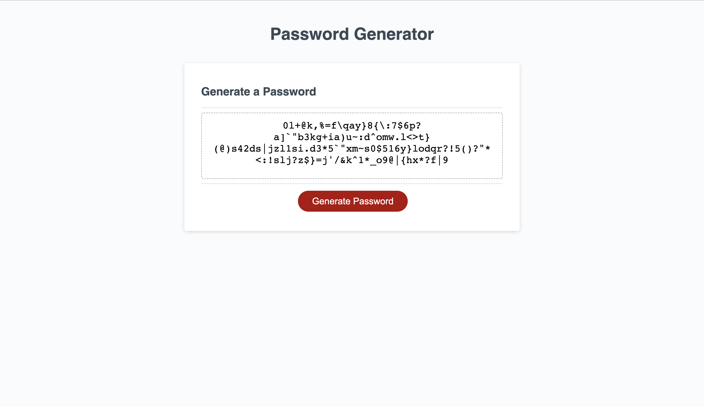

# Password-Generator

## Description
This website should help you generate a random password with what ever characters you decided to apply. Whether that be Upper Case, Lower Case, Number, or Special Chracters. You can choose how ever many characters between 8 and 128 characters. I learned what concat does in a line of command, which is to combine more than two arrays.

## Usage 
To generate a new password, you must click the generate password button and you will be presented a number of prompts to select which characters you want to include. After you select then the password will generate. 

## Credits
N/A

## License

Please refer to the LICENSE in the REPO.

## Deployed Link
https://a-monroy99.github.io/password-generator/